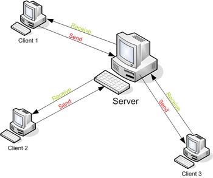

# How The Internet Works

## Objectives

``` 
- Be able to explain the difference between the Internet and the World Wide Web
- Be able to explain what a client and a server are
- Understand what an Internet Protocol (IP) address is
- Illustrate how data travels through the internet 
```

## Roadmap

### What exactly is the internet?


https://www.youtube.com/watch?v=lTonHRerMC4

Basically if you connect two devices, you have a network. Let's say that that network connected with another network, now you have a system of INTERconnected NETworks (INTER-NET).

The internet is simply a bunch of wires underground, and any two computers connected to this wire can communicate.


#### DIFFERENCE BETWEEN INTERNET AND WWW


The Internet is a global interconnection of computer networks; the World Wide Web is a way to navigate this massive network. In sailing terms, it's like comparing an ocean to a ship.


The World Wide Web, or simply Web, is a way of accessing information over the medium of the Internet. It is an information-sharing model that is built on top of the Internet. The Web uses the HTTP protocol, only one of the protocols (set of rules) used over the Internet, to transmit data. Web services, which use HTTP to allow applications to communicate in order to exchange business logic, use the the Web to share information. The Web also utilizes browsers, such as Internet Explorer or Firefox, to access Web documents called Web pages that are linked to each other via hyperlinks. Web documents also contain graphics, sounds, text and video.


The Web is just one of the ways that information can be disseminated over the Internet. The Internet, not the Web, is also used for e-mail, which relies on SMTP, Usenet news groups, instant messaging and FTP. So the Web is just a portion of the Internet, albeit a large portion, but the two terms are not synonymous and should not be confused.


### History


1957 - Sputnik 1 was sent to orbit, causing the US to take action.


1958 - US founded DARPA (Defense Advanced Research Project Agency). 


1960s - Initial concept of "packet-switching" led DARPA to development ARPANET -  an experimental network of computers to guarantee communication in the case of a nuclear attack. 

What is packet-switching? Packet-switching describes the type of network in which relatively small units of data called packets are routed through a network based on the destination address contained within each packet. Breaking communication down into packets allows the same data path to be shared among many users in the network.

Compare this to circuit-switching.

Packet switching is a _philosophy_ of network communication, not a specific protocol. The actual protocol (set of rules) that implemented packet-switching was a first attempt at what is now called TCP/IP (Transmission Control Protocol/Internet Protocol)


1969 - Only 4 servers were live in the entire network. All of these were in the west-coast.


 
1969 - The first message was sent by Professor Leonard Kleinrock's laboratory at UCLA to Stanford.


​​


1992 - Tim Berners-Lee invents the World Wide Web.

http://info.cern.ch/hypertext/WWW/TheProject.html

1993 - Mosaic, the first web-browser, changes the way we interacted with the web.

1994 - The first online sale is made. A copy of Sting's album "Ten Summoner's Tales" was sold in early August by the Net Market Company, in Nashua, New Hampshire.


###

Spend 5 minutes in your groups to research the difference between the internet and the world wide web. 


## Clients and Servers



### Servers


- Also known as "Host Computers"

- Servers are special computers whose primary function is to store, process and deliver web pages to clients. 


### Clients


- Your laptop, tablet and smartphone are all clients.

- When you view a web page your device has made a request to a server. The web page you see is the response from the server. A web browser is simply a piece of software that makes requests to a server, and then it runs the code it gets back (HTML, CSS, and JS). The code it gets back might tell it to make another request.

Let's look at some simple examples.  


### Routers

Routers exist where two or more parts of the Internet intersect. They direct the packets around the Internet.


 
Modems - Your modems and home wireless routers are the first step on your short but long internet journey. They connect you directly to your ISP.

POPs - "Points of Presence" are local connection points owned by your ISP. They are usually windowless, climate-controlled buildings filled with computers.

NAPs - "Network Accesss Points" are similar to POPs except larger. They are usually located in cities.


------

### Class Activity


Explain to the person next to you the difference between client (front-end) and server (back-end) in your own words.


How would you classify each of the following languages/frameworks/technologies? Are they front-end or back-end?

	HTML
	Python
	Javascript
	PostgresQL
	Ruby
	CSS
	DOM
	MongoDB
	PHP
	Angular.js
	Node.js
	Ember.js
	Apache
	Chrome
	Jquery
	D3.js


------


### Sending Information


 
- HTTP (Hypertext Transfer Protocol) is the protocol your browser uses to access the internet. Your computer, the client, makes requests and the server sends a response using HTTP. In the diagram above HTTP is represented in the "Application" layer.

- TCP/IP (Transmission Control Protocol/Internet Protocol) is the basic communication language or protocol of the Internet. 

- TCP manages assembling messages or files into smaller data packets that are transmitted over the Internet.

- IP handles routing packets to their correct destination using IP addresses.


### IP Addresses


Everything connected directly or indirectly to the Internet has an IP address! (servers, computers, cellphones). Your public IP address is assigned by your ISP and is your unique identifier to the external internet. 

- Google "what's my ip address" to determine your public IP address.

- Open "Network Utility" on your Mac. Under the "Info" tab there should be a dropdown menu under the heading "Select a network interface for information." Select "Wi-Fi" and your local IP address should be visible.


#### DNS (Domain Name System)


- DNS is a application layer protocol (so is HTTP)

- The primary purpose of DNS is to translate domain names which can easily be memorized by human beings (e.g., http://generalassemb.ly) into an IP address that your internet-connected device can access


###Group exercise

- Split into groups, each group will research HTTP, TCP/IP, DNS, and Ports. 

------

###How to be a Browser

+ Given a domain name, a name server search is performed on the domain name to get the IP address:

		nslookup google.com

+ If there are several IP addresses associated with the domain, the name server chooses one at random and sends it to your browser.

+ If we were to make a request to this IP adress, we can see all the routers that are between us and our destination
	
		traceroute google.com
		traceroute 74.125.224.64

+ Now, let's make an actual request to the root resource of this website. Port 80 is the standard HTTP port, we don't need to say that we are using it. To obtain the HTML code, we send an HTTP request (GET / HTTP/1.1) to the IP address. Press Return twice after typing in the below:

		curl https://www.google.com

- What information do you get back? Why is it just text? What is your browser doing with this information?


- View the public registration information for a given domain name:

``` 
whois generalassemb.ly
```


------

### EXTRA

##### Latency vs bandwidth

​

``` 
Because the Internet is a global network of computers each computer connected to the Internet must have a unique address. Internet addresses are in the form nnn.nnn.nnn.nnn where nnn must be a number from 0 - 255. This address is known as an IP address. 
```

``` 
- If you imagine the internet as a series of tubes, latency is the length of a tube between two computers and bandwidth is the width

- Latency: the longer the tube, the longer it takes for data to get from one point to another.

- Bandwidth: The wider the tube, the more data can be passed through it.
```

### LINKS/REFERENCES

- http://web.stanford.edu/class/msande91si/www-spr04/readings/week1/InternetWhitepaper.htm
  
- http://searchnetworking.techtarget.com/definition/TCP-IP
  
- http://www.howtogeek.com/148664/how-and-why-all-devices-in-your-home-share-one-ip-address/
  
- http://computer.howstuffworks.com/dns.htm
  
- https://zoompf.com/blog/2011/12/i-dont-care-how-big-yours-is
  
  ​