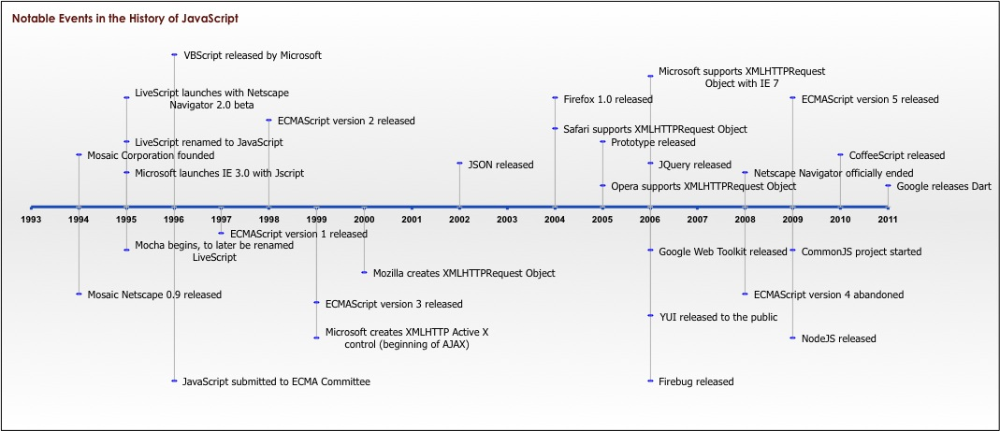

##Javascript! Data types, variables, arrays, oh my!

###SWBAT
* List the five primitive javascript data types
* Create an array and access any item in that array
* Add and remove items from an array
* Iterate over an array with a WHILE or a FOR loop


###History of Javascript



Remember MOSAIC? THe first browser?

The team behind the mosaic browser split into two startups - Netscape and Spyglass.

Netscape wanted to bring interactivity into the browser - something applications had lost when they moved to the browser (compared to desktop models).


With this in mind, Netscape announced it was going to destroy Microsoft. So... Microsoft bought Spyglass, the other half of the MOSAIC team, in order to compete. They renamed Spyglass to Internet Explorer, and thus the first of the Browser Wars began.  


Sun Microsystems and Netscape joined forces against Microsoft as they knew they would both be crushed if they didn't work together. 

At the time there was a lot of excitement about Java. The language of the browser was MEANT to be Java - it was the hottest new language, it was going to be one language to rule them all. Java applets in 1995 were going to rule the world. 

Sun believed the best way for them to work together was to put Java (a language developed at Sun Microsystems) in the Netscape browser.

Netscape didn't believe in Java as strongly as everyone else. In fact, they hired Brandon Eich to make a new language. He kind of mushed Java, Scheme, and Self (old programming languages) together to create LiveScript, which allowed interactivity on webpages.

To play on the popularity of Java, and to placate Sun, they simply changed the name of LiveScript to JavaScript. Sun ended up owning the trademark for JavaScript. 

Microsoft got scared and reverse engineered their own version of JavaScript, calling it JScript.

Netscape/Sun got scared themselves they didn't want their own language to be extended away from them - so they tried to get a standard for this language. The only respected group that would formulate a standard for the language was the European Computer Manufacturing Association (ECMA).

An odd thing about the standards process at the time was that Sun wanted a standard for JavaScript, but because they owned the trademark, ECMA (the standards agency) couldn't call the standard "Javascript". Instead, they came up with ECMAScript. 

So the summary is that that the birth of JavaScript was messy and painful. 

"Javascript" now pretty much refers to JScript, ECMAScript, and Javascript. They are all the same language. 


##Types

A **type** in a programming language specifies a **kind of data**. While this might not be the most technical way to describe it, it's how we're most likely to think about it. 

Javascript has five **primitive** types:

* String - characters or textual data..stuff like:  "abc", and "hello there 123"
* Number - just like it sounds..this is a number: 123 or 12.3
* Boolean - these are truthe or false values 
* Null - has exactly one value which is: null . This is used to signify an empty value. 
* Undefined - usually this is a variable that hasn't been initialized: 'var x;' will result in x being undefined at this point.  


What does that mean...that they live in caves? No, in the context of Javascript we can think of them as being base line values.


Javascript also has the notion of:

* Object

Objects are complex types with many properties and methods attached or 'built in' to them. An object can be thought of as a logical containment unit for values, and functionality that will manipulate or provide access to those values. There is a special type of object called an Array, but for now, as we are learning JavaScript for the first time, I would like you to think of Objects and Arrays as different things that share some stuff in common. 


What's the point of knowing these data types? Because each data type has a whole bunch of built-in methods you can call on it. 

Try this in your console:
```
"hello".length

3.length
```

Now try this:
```
"carrot" - "car"

6 - 3
```

lastly, try this:
```
3 + 5

"tea" + "pot"
```

Interesting... we can use the "+" operator on both the number type AND the string type. But it does something different for each of them.


##Variables
What's the point of having data types if there is nowhere we can temporarily store them?

This is where variables come in.

The special word (keyword) var indicates that this sentence is going to define a variable. It is followed by the name of the variable and, if we want to immediately give it a value, by an = operator and an expression.

This is not arithmetic, this is "assignment".

So we can say 
```
var x = 1
x = x + 9

console.log(x) => gives us what?
```

How do we name variables? Use common sense and camelCase.

We will come back to how variables are stored later...

###Array of hope!
**What is an Array**

*    A container for data, similar to a list. You could think about it like a pill box.
*   An array is a data structure
*    Each item in an array is called an element.
*    Arrays can hold all kinds of different data types: strings, integers, objects, functions, even other arrays!

What types of arrays did we see in the prework?

Theres two ways to create an array right, one that you all have seen before and one that relatively rare, but I still want you to be able to understand

```
// rare syntax
var superheroes = new Array("Batman", "Superman", "Blaise", "Captain Marvel");

// what we're going to be using
var superheroes = ["Batman", "Superman", "Blaise", "Captain Marvel"];

```

So we know how to create an array, the most important thing we're going to be using them for is to access the elements inside of them.

What would I need to type to access the element "Batman" in my `superheroes` array?   
`superheroes[0]` right?

How could I access "Blaise"?

Think of it like years in your life. You start at zero and go from there. 

###Quick mini-task
I want you all to break up into groups and create an array of your favorite sports teams and test out some different methods on that array, I'll call on your group after 5 minutes and ask you to explain what one of these methods do, and an example of why you might want to use it.

*    `Array.push()`
*    `Array.pop()`
*    `Array.shift()`
*    `Array.unshift()`
*    `Array.sort()`
*    `Array.reverse()`

What does it mean to 'return' something?


###Loops
**What is a loop** 

So far we've used two different loops in Javscript right? What are they?

* `While`
* `For`

###While Loops

Let's start with a `while` loop and then move onto `for` loops later.

Whats the two parts of a while loop:
* A condition that it checks
* Something that it does

I want you all to walk me through creating a while loop that will `console.log` every number from 1-9


As an exercise I want you all to put this into practice
* Create an array of all the members of The Beatles!
* Loop through The Beatles, and console.log each one introducing himself.


####For Loops
While loops are similar to For loops, but for loops are better because they take care of the assignment, the run condition and the incrementation/decrementation all in one step.

Why is it called a for loop? 

	"The loop body is executed 'for' the given values of the loop variable"

```
for(assignment; run condition; increment/decrement){
    //LOOP ACTION HERE
}
```

* THE ASSIGNMENT sets a variable before the loop begins
* THE RUN CONDITION defines the condition for the loop to run
* INCREMENTS/DECREMENTS executes after each completed loop  

While Loops are similar to For Loops, but with the assignment & end conditions left out

Lets loop through an array of people and `console.log` both the `index` and the `element`

I want you all to pair up now and describe what is happening in this loop to each other

Lets create another one but have it log in reverse.

We will have to subtract 1 from `Array.length` in our assignment. 

What will our new end condition be? 

What about our increment condition?

```js
  var numbers = [1,2,3,4,5,6,7,8,9,10,11,12,13,14];
```
* Create a loop that loops through this array from end to start but jumps by two each time.

* Create another loop that only prints out multiples of 3.

Why don't we convert our veggies loop that we wrote at the start and convert it to a `for` loop!

**Avoiding Infinite Loops**

Loops operate based on conditional statements, running as long as the condition it is checking against is true. Take care not to write a condition that will always evaluate to true, otherwise you will create an infinite loop that will crash your browser (and maybe your whole computer!!!).

##Final task - in pairs
1) Create a folder that contains index.html, styles.css, and app.js, and open it in sublime.

2) Link your styles.css and app.js files to your index.html.

HINT: put this at the bottom of your page, just before the closing ```</body>``` tag:
```
<script type="text/javascript" src="app.js"></script>
```
3) Check that it works by using alert("it works!") or console.log("it works!");

4) In your JS, make an array of people on your table.

5) Use a for loop to iterate through the array

6) Inside the for loop, use document.write() to print out each person to the web page. 


