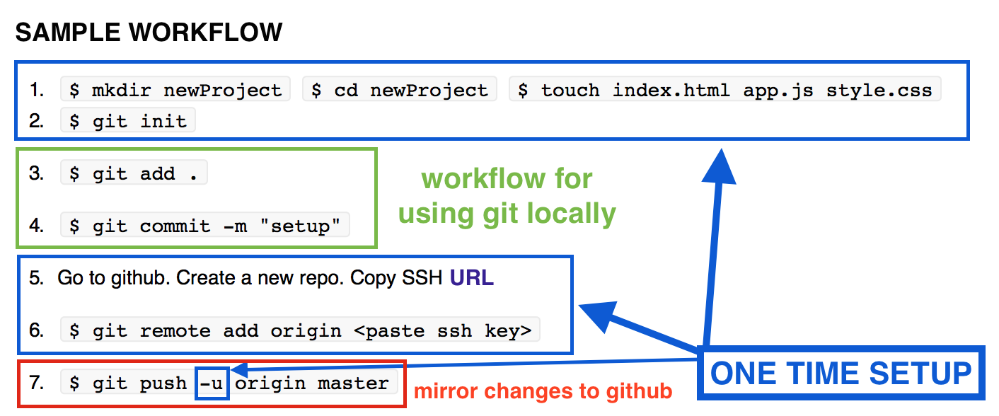

#[Intro to Git + Github](https://docs.google.com/presentation/d/1ImXFJ2Stiojumbpvk_GTMvBTrQVXNZuEt4E-cTGejVU/pub?start=false&loop=false&delayms=15000)

* Cloning the class repo
* HTTPS v SSH
* Git v Github
* Forking v Cloning
* GIT WORKFLOW
 	* Suggested workflow
	* Using Git locally
	* Mirroring changes to remote locations (Github)
* Lab

# 1. Cloning the class repo


`TASK:`
Navigate to the [class repo](https://github.com/ga-students/WDI_LA_18) 

1. Locate the HTTPS clone URL
2. Copy it
3. In terminal, navigate to a location where you would like to house this repo locally on your computer (it can be anywhere of your choosing!) 
4. Do: `git clone https://github.com/ga-students/WDI_LA_18`
5. Watch the repo clone down. 

---

Notice that you have a fresh copy of the class repo, locally. 
Delete it and do it again! Its important to know that this is free and quick and if you ever get muddled up really badly in your local repo, re-cloning, might be the quickest solution. 

##Gotchas
* The class repo is not exactly a great example of a typical repository. Despite this it still operates by the same rules. 
* Typically it is best practice to have a single project per repository. 
* This enables version tracking and branching to be used effectively.
* In the class repo we are sharing lots of different markdowns,  and starter code, as well as solution code, for a number of projects. 
* Only instructors have the right to edit the class repo.
* This means that if you make changes to your local copy of the class repo, they risk being overwritten next time you pull an updated copy.
* Version control (git) does this for us to keep a clean slate.

--- 

####Lets try out some new commands

* `git status`
* what did this do?
* `git fetch`
* `git merge`
* `git pull` (NB! we will be using this a lot. A git pull is a bit like `fetch` + `merge` combined)


#2. HTTPS v SSH


`TASK: `

Pair up with your neighbor and take 2 minutes to research the difference between SSH v HTTPS and the advantages of using one or the other when cloning a github repo. 

---

[Here](https://help.github.com/articles/generating-ssh-keys/) you will find all the information that you need for setting up SSH keys on your computer. If there is remaining time at the end of this session we will attempt to do this. 

Secure Shell, or SSH, is a cryptographic (encrypted) network protocol for initiating text-based shell sessions on remote machines in a secure way.

In future, SSH will be a critical tool for programming servers etc... but for now, the only difference between cloning a repo using SSH v HTTPs, is that it will allow you to skip authentication step (if you use SSH) in private repos (such as the class repo). **Non critical**. But still useful, as we will be doing it a lot. 

#3. Git v Github

`TASKs: `

1. Pair up and explain to your neighbor everything you know about git, and github.

2. As a whole class, open a google docs and all start typing name and addresses. 
 
---
 
###What is Git?

  - ```git``` is an open source, distributed version control system.  
  - programmers use ```git``` so that they can keep the history of all their changes to their code
    - so that they can undo changes as far back as possible
  - programmers also use ```git``` so that multiple people can work on the same files
    - kind of like google docs
    - so that you can review changes made by a different person
  - a codebase in git is referred to as a **repository** (or **repo** for short)

### What is Github? 
 - A web-app hub for git! (social network of programmers)
 - We all have individual accounts, and put our code on our Github account
 - You can follow users, star certain people's projects
 - Can also be used to make changes to somebody elses repo

**Note**: MANY students feel github is git and git is github.  Break this apart for students.  Describe repeatedly how github is a company that uses git.  

**Question**: can you use Git without Github?

**Answers**: 

 - Certainly!!
- It’s like watching a movie without using netflix!  Of course you can!
 - Git was made before Github, by different people


#4. Forking v Cloning


`TASK: `

Take 2 minutes to research the difference between Forking v Cloning and the advantages of using one v the other. 

---

A fork is a copy of a repository. Forking a repository allows you to freely experiment with changes without affecting the original project.

Most commonly, forks are used to either propose changes to someone else's project or to use someone else's project as a starting point for your own idea.


`TASK: `

1. Fork the class repo
2. Notice that this fork is still on github, just now on your github account.
3. Notice that your fork is also private, because the original source is private. Private repos on github are not free (private repos on bitbucket are free!)
4. To get this fork onto your local machine -> yup! you still have to clone it. 
5. Clone it!
6. Make a bullet point list of the steps you will have to go through in order to update you local repository form the **ORIGINAL SOURCE** 


`TASK` 
Take 5 minutes to read [this page](https://help.github.com/articles/fork-a-repo/) 

#### From a fork or clone, we can do work and submit it as a Pull Request (we will learn to do this in a later lesson) 

#5. GIT WORKFLOW

> Repository: a place, building, or receptacle where things are or may be stored.

Such as code. 

Don't we just store code in directories? 

Repositories are under the control of Git. A **Distributed Version Control System**. 

###SAMPLE WORKFLOW

1. `$ mkdir newProject` `$ cd newProject` `$ touch index.html app.js style.css	`
2. `$ git init`

3. `$ git add .`

4. `$ git commit -m "setup"`

5. Go to github. Create a new repo. Copy SSH URL

6. `$ git remote add origin <paste ssh key>`

7. `$ git push -u origin master`


Task: Pair up and make notes of steps 1 through 7 explaining EXACTLY what each step does. We will review as a class.


#### Breakdown of the workflow:

1. We already know, and are comfortable with `mkdir` `cd` and `touch`
2. Git initialize a repository:  This is like saying: “I want this directory to use git!  Please set that up for me!”

	`git init`

3. Add files to staging area:

	`git add .`  adds all files in this directory to the repo staging area.
	`git add filename.txt` adds the single file 'filename.txt' to the staging area. The staging area is where we prepare our commit. You can think as a commit as a 'stamp'. I like to imagine `git add` as similar to [typesetting](https://youtu.be/G3XbItz55YE?t=30s) and `git commit` as similar to the stamping of the [print press](https://www.youtube.com/watch?v=DLctAw4JZXE)

4. Commit

		`git commit -m "strongly descriptive commit message"`
		
	This is like saying: “Please remember this exact state”


5. Go to github. Create a new remote repo. Copy SSH URL. This is the address of this repo. 

  1. Go to your github account
  2. In the top left, hit the + button and select ```New repository``` 
  3. Name your repository   (opt out of creating a readme.md, you can do this locally)
  4. Click the big green Create Repository button
  5. On the next screen you will be presented with a step by step guide, similar to the workflow proposed above, and the SSH URL. Copy it.

6. Connect your local and remote repositories:

	`$ git remote add origin <paste your ssh url>`
	
	"remote add" can be thought of as a single command to add a new remote repo. Git remote has other options like "remove". "remote add" accepts two arguments: the first is a string, the name that you wish to refer to this remote repository by: "origin". This is a conventional for our main source. The second argument is the **SSH URL** so that it knows where it is...
	
	It is important to note that `git remote add` just like `git init` is a one time process and is only necessary during setup.
	
	
7. Push changes to github
	`$ git push origin master` 
	


##BREAKDOWN: 




Run ```git log```
- you can now see the history of changes, with only one change
- if you made more changes, there would be more here.
- Prompt students to discuss how a log of changes might be helpful
- Bring up collaboration
- Bring up finding when a mistake was added to a project


--- 

#6. LAB

Your task is to rebuild TicTacToe from scratch, in 1 hour. (Yup! All the work you did this weekend in one hour)
You may copy and paste from your existing project. Do this in sections and leave a clear commit message each time. 

Use this opportunity to clean up and refactor your code. There should be one comment per line of code in your JS. 

The goal is to have a nicely cleaned up project, with a clear commit history. 

60 minutes…. GO
