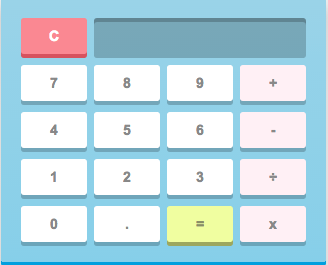
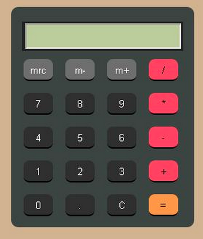
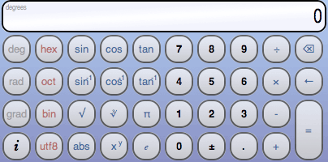

# Super-cali-fragilistic-maths-is-so-bodacious javascript css super everything awesome review lab!

## Requirements

Using everything you've learned so far about Javascript variables, objects, functions, loops, events, and the rest, **build yourself a handy and useful calculator.** Write separate functions that calculate each thing you need. If you can, wrap it all up in an object to start practicing using objects practically.

**The idea is to get practice building front-facing, interactive Javascript applications with vanilla Javascript.** Make it pretty, and make it fun.

###### - - Important Workflow Note - -
Before starting, make it a git repository, and set it up to be able to push to Github. As you work on it, make _frequent_ and regular commits, and make sure your commit messages are telling of what changes you've made as you do them. Remember – git is to help you keep track of your history, and the more history you have, the better.

At the end of the class, slack out a github link to your project – no matter how finished it is – so we can all see how everyone made their calculators.

Here are some possible visual examples:

------

### Basic Challenge Requirements

- Have a fully functional calculator that can ***ADD***, ***SUBTRACT***, ***DIVIDE***, and ***MULTIPLY***
- Implement a “Clear” button/function that clears the current
- An operator should not be allowed to be the first character in your equation
- Don’t allow the user to enter two operators (e.g. +,=,*,/) back to back

### Challenge Add-ons

- Don’t use the eval() function in your code
- Create buttons/functions that implement features found in scientific calculators (e.g., ***log***, ***sin***, ***sqrt***, ***exponentials***, etc.

------