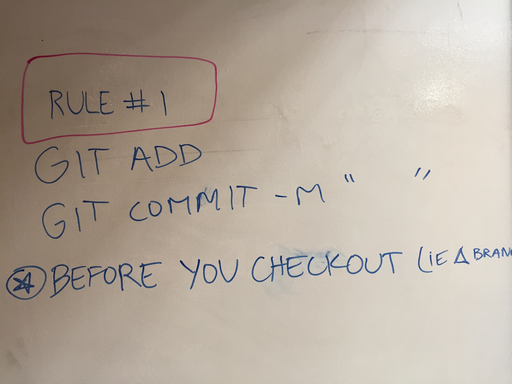
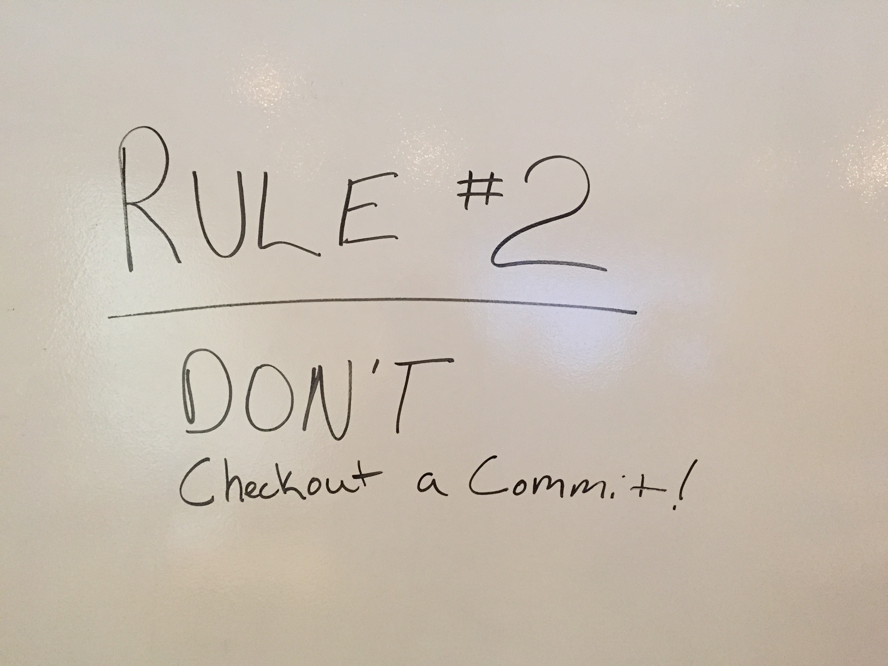
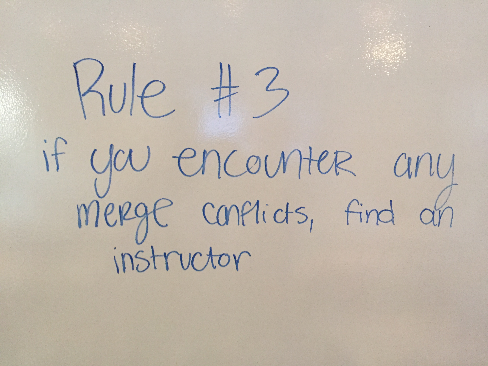

#Git workflow

###New Workflow using branching (assuming you have already done the one time setup stuff: `git init`, `git remote add`, etc...)

* navigate to your project directory
* `$ git status` (tells you the status)
* `$ git branch` (tells you what branch you are on)
* `$ git checkout branchname` (checks you out to a new branch where you can do work)
* "do code"
* `$ git add .`
* `$ git commit -m "strong commit message"`

Now we have two options :

1. Push (backup) changes to gitub without merging to master:
`$ git push origin branchname `

2. Merge to master, then push to github
`$ git merge master`
`$ git push origin master`

##RULES

