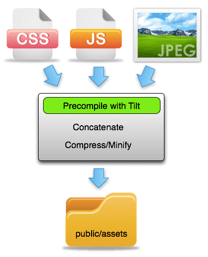

#MORE RAILS: Partials && The Asset Pipeline

###SWBAT 

* Learn how to create partials and render them
	* Code along for form partial
	* Try it yourself for a navbar 
	* Talk about some basics of logic in your view templates. 
	* Research Rails helpers
* Understand the basic mechanics of the Asset Pipeline
	* CSS and SCSS precompiling. 
	* Minification
	* Images and other assets 

##Partials

**TASK** : In pairs, research how partials work and use the rails docs to create a partial view template.

**Code along** for extracting the forn from coffeeshop new and edit, into a partial.

**TASK** Create and render a navbar partial 

Consider the uses of this and discuss the benefits of extracting code for readability and for the purposes of staying organized. 

 

The application.html.erb should be VERY DRY, and minimal.


##Asset Pipeline


1. **TASK** : In pairs, research the rails asset pipeline (5 minutes)

2. **GROUP DISCUSSION**: How does it work? 


	


3. **Explain** :

	```
	<%= stylesheet_link_tag "application", media: "all" %>
	<%= javascript_include_tag "application" %>
	```

4. **Practise using**:

	```
	<%= image_tag "icons/rails.png" %>
	```

5. Practice using the other [ActionView::Helpers::AssetTagHelper](http://api.rubyonrails.org/classes/ActionView/Helpers/AssetTagHelper.html)


6. **Understand** [precompiling assets](http://guides.rubyonrails.org/asset_pipeline.html)