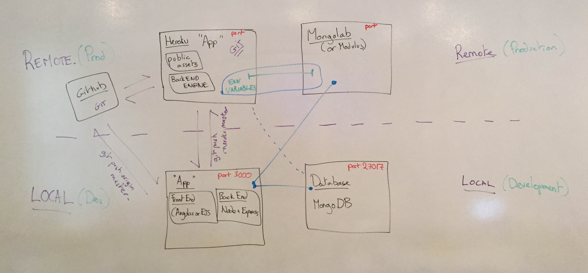
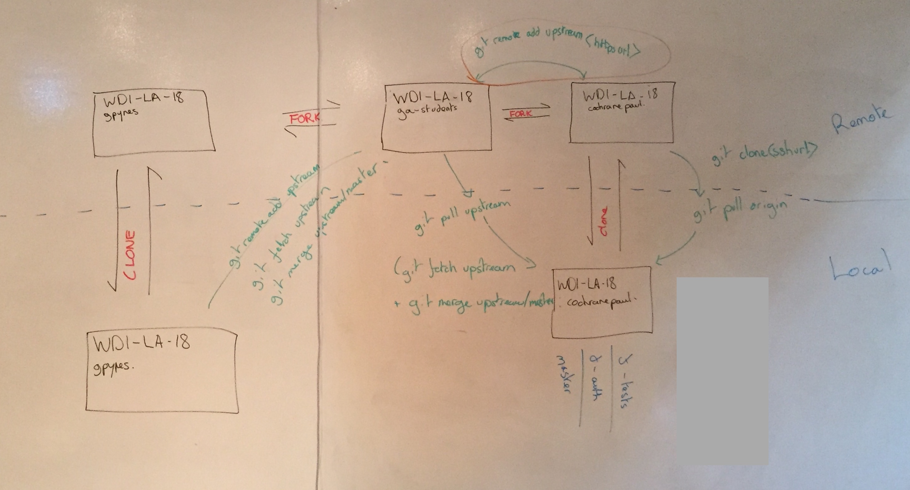

#Node + Heroku + Review Session
 by blaisethomas @ GA LA

---

Deploying is a highly procedural yet simple operation, that is dependent upon the specific app that you are trying to deploy.   

###Resources

#####Asides//recaps:

[BodyParser](http://www.senchalabs.org/connect/bodyParser.html) a better explanantion

[cool scotch.io](https://scotch.io/tutorials/build-a-restful-api-using-node-and-express-4) demo for building a node-express app

Interestingly, highly opinionated, but a little lacking in the final steps [tilcode tutorial](http://www.tilcode.com/deploying-a-mean-stack-app-to-heroku/) tutorial about deploying.



---

#####More deployment specific: 

Here is a little URL trail of resources useful to completing / deploying a Node Express Mongo app

[heroku docs](https://devcenter.heroku.com/articles/git) on deploying with git

[mongolab](https://mongolab.com/) hosts your mongoDB 
or [modulus](http://docs.mongodb.org/ecosystem/platforms/modulus/)

[connecting mongoose to dbs](http://mongoosejs.com/docs/connections.html)

[mongo connection](http://docs.mongodb.org/manual/reference/connection-string/)

interesting blog post about [mongoose](http://blog.mongolab.com/2014/04/mongodb-driver-mongoose/)

[heroku docs on mongoose](https://devcenter.heroku.com/articles/mongolab)

[heroku addon for mongolab](https://addons.heroku.com/mongolab?utm_campaign=category&utm_medium=dashboard&utm_source=addons)

[heroku deploy tutorial](https://devcenter.heroku.com/articles/getting-started-with-nodejs#introduction)


##Let's practice deploying:

 * (clone the project you want to deploy)
 * cd (in to it)
 * `$ rm -rf .git`  
 * `$ git init`
 * `$ git add -A`
 * `$ git commit -m "first commit"`
 * `$ git remote add origin https://github.com/username/reponame`
 * `$ git push -u origin master`


Make sure that your port and db's are set:

```
var DB = process.env.MONGOLAB_URI || 'mongodb://localhost:27017/men-blog';
var port = process.env.PORT || 3000;

```


Make sure that your package.json has a start script:

```
"scripts": {
    "start": "node server.js"
  }

```

 
 * `$ heroku login`
 * `$ heroku create`
 * `$ git push heroku master`
 * `$ heroku ps:scale web=1`
 * database, using mongolabs:
 	* `$ heroku addons:create mongolab`
 	* `$ heroku addons:docs mongolab`
 	* `$ heroku addons:open mongolab`
 	* `$ heroku config | grep MONGOLAB_URI`
 * `$ heroku logs`
 * `$ heroku open`
 * `$ heroku local web` with Procfile: `web: node index.js` (runs production env. code locally)

 
 ---
 
## Reminder of git team workflow:

 


 
 
