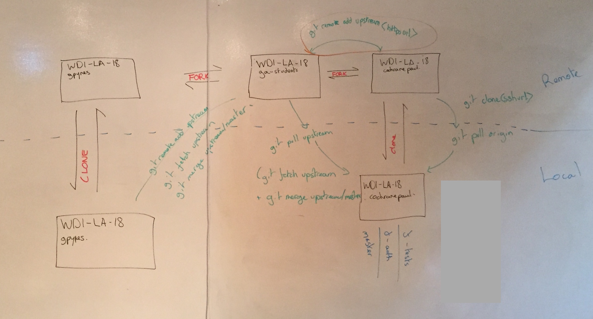

# Team Workflow Using FORKS

1. The Project Manager creates a repo on github with all the starter code.

2. All team members should fork that repo

3. Each team member should git clone their fork so that they can work on it locally

4. Each team member needs to add a new remote called upstream and set it to the original repo in step 1 using the https or ssh url:

	`$ git remote add upstream (ssh uri of original repo)` 

5. Now you will be able to stay in sync (pull new code) by doing:

	`$ git fetch upsteam master`
	`$ git merge upstream/master`

6. when you are finished developing your code and are ready to push simply do:

	`$ git push origin branchname`

7. Once your branch is on github you can submit a pull request accross a fork to the original repo. 

##Let's test it out:

1. Fork the class repo
2. Clone the class repo
3. Take out a new branch
4. Do some code
5. `$ git push origin branchname`
6. submit a pull request to the class repo. 

To stay in sync with the class repo.

`$ git remote add upstream git@github.com:ga-students/WDI_LA_18.git`
`$ git fetch upsteam master`
`$ git merge upstream/master`

