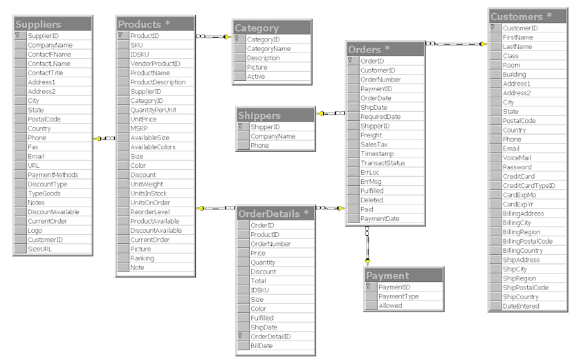

#Ecommerce

###ROADMAP:
Building an e-commerce app (the breakdown + examples in rails & node)

1. Complexities of e commerce (intro)
2. Payment Gateways
3. Rails examples
4. Node examples


##Intro
#### Consider the complexities of an e commerce platform:

* Payment Gateways
* Products
* Stock management
* Shipping / Delivery tracking / returns
* Customers
* Suppliers
* Subscriptions
* Coupons (discounts and expiry dates)
* Shopping cart (using cookies to make a shopping cart before the user has registered)
* Analytics
* Accounting / Finance

Thankfully this is a problem that has been well sovled, many times. Today we will be looking at a variety of pre-built solutions in both Ruby and Node & how to hookup payment gateways. 

Consider the following data model. 



The data model is not the only thing that is complex. In considering how to create an e commerce solution, your app will be the epicenter of a lot of moving parts. 


##Payment Gateways

Payment gateways are API's that handle the processing of card transactions. They make handling transactions very easy through simple interaction of APIs. In exchange they will ususally take a small fee. Compliance for CC transactions is pretty strict so they are a fantastic solution to get up and running quickly. 

From spreecommerce documentation: When researching payment gateway options, you may find that they offer an all-in-one solution that includes both the gateway and the merchant account. This is just something to be aware of and to evaluate if it makes sense for your store. Payment gateways also charge a fee for their services. Here are a few of the fees you might come across when evaluating providers:

* Setup Fee - A one-time charge to set up your payment gateway account.
* Recurring Fixed Monthly Fees - A fixed monthly fee that a payment gateway provider charges for access to their services and reports. Some gateways break this charge down further into a monthly Gateway Fee and a Statement Fee.
* Transaction Fees - A charge for each purchase made on your e-commerce store. The pricing structure for these fees differ per gateway. A popular structure is to charge a percentage of the purchase price plus a flat fee. For example, 2.9% of the purchase price plus $0.30 per transaction.

A few options: 

* [Stripe](https://stripe.com/) This is a very popular option. Check out their website for a list of users. They charge a very reasonable fee and their API is easy to use. 
* [Paypal](https://developer.paypal.com/docs/classic/products/payflow-gateway/) Everyone knows paypal. Paypal can take CC payments in addition to PayPal payments. 
* [QuickBooks](https://developer.intuit.com/docs/0050_quickbooks_api) this is a newer and very interesting solution. Quickbooks is an accounting platform offering a variety of accounting products that are industry standard (in the accounting world). They now also offer a payment gateway which works really nicely with their accounting API. The advantages of this are really significant if you are using Quickbooks to do your books. 
* [BitPay](https://bitpay.com/bitcoin-payment-gateway-api) This is a very popular option for taking bitcoin payments, although bitcoin are now accepted by other major payment gateways (such as Stripe)


##Example in Rails


We already looked at the data-model, from our Rails experience, we know how to translate that into an app. 

Thankfully there are a large number of template Rails apps for ecommerce. [Spree](https://spreecommerce.com/) is an open source option. You will need to integrate a payment gateway such as Stripe. Spree is a really popular platform and really simple to use. It has a ton of features built in for managing all logistical aspects of managing an ecommerce platform. 

Yep! There's a [gem](https://github.com/stripe/stripe-ruby) for that!

There is also a rails add on called [rails composer](https://github.com/RailsApps/rails-composer) that is super useful for starting new rails projects.

This is a fully completed solution for a membership subscription rails app, including Stripe API [link](https://github.com/RailsApps/rails-stripe-membership-saas)

[Payola](https://www.payola.io/) is a drop-in Rails engine that helps you sell products and subscriptions just by including a module in your models.


##Example in Node

[This](https://github.com/eddywashere/node-stripe-membership-saas) example was inspired for the above rails project. Essentially the exact same thing, but built in Node.


##Mini-Lab (optional) "I Take Credit Cards" 

Use stripe (or other payment gateway) to create a simple app that receives a payment for x dollars. If you hook up an account on the payment gateway of your choice, you will forever be able to accept CC payments on the go through your app. "I don't have cash" will no longer be an excuse for your friends to dodge splitting the bill...

stripe setup in ruby:

```ruby
# Set your secret key: remember to change this to your live secret key in production
# See your keys here https://dashboard.stripe.com/account/apikeys
Stripe.api_key = "sk_test_1yOL11f7fRLxHOOUGElNT06E"

# Get the credit card details submitted by the form
token = params[:stripeToken]

# Create the charge on Stripe's servers - this will charge the user's card
begin
  charge = Stripe::Charge.create(
    :amount => 1000, # amount in cents, again
    :currency => "usd",
    :source => token,
    :description => "Example charge"
  )
rescue Stripe::CardError => e
  # The card has been declined
end
```

stripe setup in Node:

```javascript
// Set your secret key: remember to change this to your live secret key in production
// See your keys here https://dashboard.stripe.com/account/apikeys
var stripe = require("stripe")("sk_test_1yOL11f7fRLxHOOUGElNT06E");

// (Assuming you're using express - expressjs.com)
// Get the credit card details submitted by the form
var stripeToken = request.body.stripeToken;

var charge = stripe.charges.create({
  amount: 1000, // amount in cents, again
  currency: "usd",
  source: stripeToken,
  description: "Example charge"
}, function(err, charge) {
  if (err && err.type === 'StripeCardError') {
    // The card has been declined
  }
});

```


