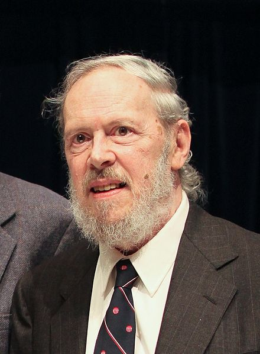

#Intro to C



**Dennis MacAlistair Ritchie** (September 9, 1941 – c. October 12, 2011) was an American computer scientist. He created the C programming language and, with long-time colleague Ken Thompson, the Unix operating system.Ritchie and Thompson received the Turing Award from the ACM in 1983, the Hamming Medal from the IEEE in 1990 and the National Medal of Technology from President Clinton in 1999. Ritchie was the head of Lucent Technologies System Software Research Department when he retired in 2007. He was the "R" in K&R C and commonly known by his username dmr.

His death came a week after the death of Steve Jobs but did not receive as much media coverage. Following Ritchie's death, computer historian Paul E. Ceruzzi stated:

> Ritchie was under the radar. His name was not a household name at all, but... if you had a microscope and could look in a computer, you'd see his work everywhere inside.


---

**Task** > Take a moment to read the wikipedia page on history of programming:

[History of programming](https://en.wikipedia.org/wiki/History_of_programming_languages)

---

###What language is Javascript written in?

Perhaps this is not a very accurate question:

Javascript is just a standard, more formally known as ECMAScript. It can be implemented in any language, just like any standard. 

Chrome's Javascript engine, V8, is written in C++.

(Can Javascript be implemented in Javascript?)


###What is c++ written in?

Again, not a very accurate question. 

C++ is a general-purpose programming language. It has imperative, object-oriented and generic programming features, while also providing facilities for low-level memory manipulation.

Before the initial standardization in 1998, C++ was developed by Bjarne Stroustrup at Bell Labs since 1979, as an extension of the C language as he wanted an efficient and flexible language similar to C, which also provided high-level features for program organization.

Many other programming languages have been influenced by C++, including C#, Java, and newer versions of C (after 1998).

###Intro to C

[The C Programming Language](http://www.amazon.com/The-Programming-Language-Brian-Kernighan/dp/0131103628) by Brian W. Kernighan, Dennis M. Ritchie is the resource used for the following section:

C is a general-purpose, imperative computer programming language, supporting structured programming, lexical variable scope and recursion, while a static type system prevents many unintended operations. By design, C provides constructs that map efficiently to typical machine instructions, and therefore it has found lasting use in applications that had formerly been coded in assembly language, including operating systems, as well as various application software for computers ranging from supercomputers to embedded systems.

---

When we write in C we should save our files with the extension '.c' Example hello.c 

C needs to be compiled. On our UNIX macs we can do this using a built in compiler. 

We can do this at the command line using `cc hello.c`

This will generate an output file named a.out which we can run from the command line:

`./a.out`

This is machine language. We can disassemble this to assembly using a disassembler to see what are the instructions. You can grab NDISASM from the NASM package. Store the bytes in a file and run:

`ndisasm a.out`

You can capture the output of this into a new file by running:

`ndisasm a.out > hello.asm`


Let's build a simple program: Hello World!!!! Our favorite program. 

```c
#include <stdio.h> 
main() 
{
	printf("hello, world\n"); 
}
```

Let's break it down:

```c
#include <stdio.h> 			//include information about standard library

main() 			  			//define a function named main that receives no argument values
{ 					  			//statements of main are enclosed in braces
	printf("hello, world\n"); // main calls library function printf to print this sequence oj characters; \n represents the new line character
}
```

###Assembly Language / Machine Language

Machine language is the actual bits used to control the processor in the computer, usually viewed as a sequence of hexadecimal numbers (typically bytes). The processor reads these bits in from program memory, and the bits represent "instructions" as to what to do next. 
Thus machine language provides a way of entering instructions into a computer (whether through switches, punched tape, or a binary file). 

Assembly language is a more human readable view of machine language. Instead of representing the machine language as numbers, the instructions and registers are given names (typically abbreviated words, or mnemonics, eg ld means "load"). Unlike a high level language, assembler is very close to the machine language. The main abstractions (apart from the mnemonics) are the use of labels instead of fixed memory addresses, and comments. 

An assembly language program (ie a text file) is translated to machine language by an assembler. A disassembler performs the reverse function (although the comments and the names of labels will have been discarded in the assembler process). 
machine language faster than assembly language even than assembly language depend upon machine language

So Machine Language is essentially the language that your microprocessor will run:

* IA-32
* x86-64 
* ARM
* MIPS

To learn more about assembly language in MAC this awesome tutorial walks you through building Hello World in Assembly and then using an assembler to compile it to machine code. [link](http://www.idryman.org/blog/2014/12/02/writing-64-bit-assembly-on-mac-os-x/)

###Lab

The next program uses the formula `celsius = 5 * (fahr-32) / 9;`
 to print the following table of Fahrenheit temperatures and their centigrade or Celsius equivalents:

|F   | C
|----|----
|o   |-17 
|20  |-6 
|40  | 4 
|60  | 15 
|80  | 26 
|100 | 37 
|120 | 48 
|140 | 60 
|160 | 71 
|180 | 82 
|200 | 93 
|220 | 104 
|240 | 115 
|260 | 126 
|280 | 137 
|300 | 148


